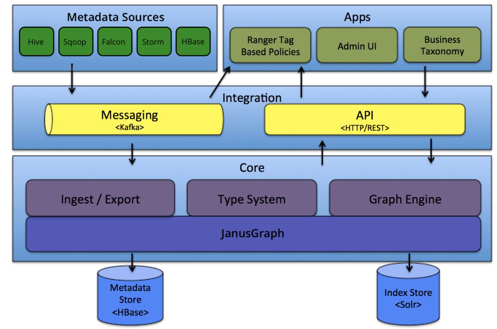
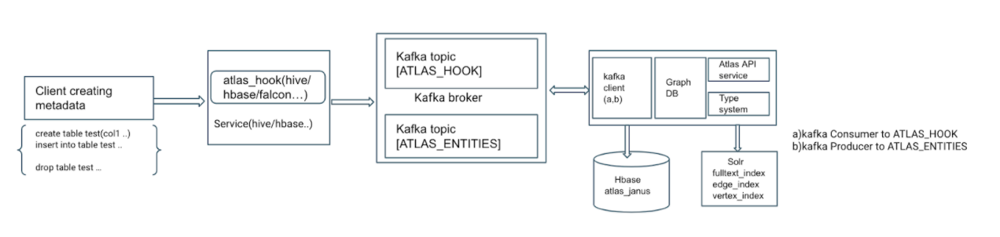
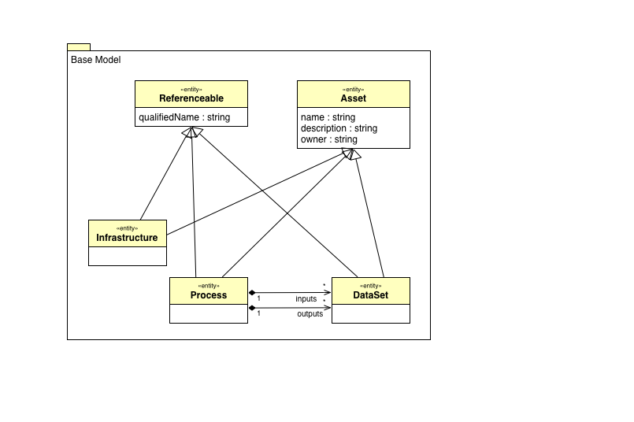

# Atlas Workshop
Purpose of this workshop is to understand Atlas architecture, configuration and features. We will also look into some use cases (Liineage, Ranger Tag policies).
In this workshop, we will understand the working of Atlas by decoupling each of the dependent service. First part introduces users to Atlas dependent services and how failure/misconfiguration of these services effects function of Atlas. At the end of the first part we will make sure Atlas is functional and summarize the role of each dependent service.

## *Prerequisites for Atlas workshop :*

* CDP DC cluster built on Squadron with Data-Operational template.
* Kerberize cluster using One-click scripts.
* Update Atlas Configuration to use File Based Authentication (atlas.authentication.method.file).

## *Atlas Architecture for reference :*

We will discuss and understand all the components in this architecture throughout our workshop while reviewing configuration and troubleshooting in some areas.



## *LAB 1 : Understanding Atlas service pre-requisites, configuration and troubleshooting the setup in squadron*
 
 
### *LAB 1.1 : Hbase configurations for Atlas service :*

**Step 1 :**  Once cluster is setup and Kerberize, try accessing Atlas UI and verify if it is up and running after restart. Atlas web UI should give 503 exception. 

**Step 2 :** Review the /var/log/atlas/application.log on atlas logs for further troubleshooting.

```
# tail -f /var/log/atlas/application.log
[..]
Caused by: org.janusgraph.diskstorage.TemporaryBackendException: Temporary failure in storage backend
at org.janusgraph.diskstorage.hbase2.HBaseStoreManager.ensureTableExists(HBaseStoreManager.java:732)
```

Prior to troubleshooting the issue, lets understand the atlas service pre-requisites.

Atlas depends on Hbase/HDFS,Kafka,Solr service. Before starting Atlas service , all these services must be up and running with permissions set on resource to allow Atlas user access.

---
**Step 3:** Review the hbase related configs

Atlas is an application that uses janus graph database (titan graph DB prior to HDP 3.x). Janus graph DB relies on backend storage like Hbase or Cassandra.
Ref: [https://docs.janusgraph.org/](https://docs.janusgraph.org/) 

**Step 3.1 :** Review the atlas configuration to verify if all the configured backend services are available and accessible with atlas service principal. 
Login to atlas host and verify the configuration.

```
# export ATLAS_PROCESS_DIR=$(ls -1dtr /var/run/cloudera-scm-agent/process/*ATLAS_SERVER | tail -1)
# egrep 'hbase|storage' $ATLAS_PROCESS_DIR/conf/atlas-application.properties
atlas.audit.hbase.zookeeper.quorum=c416-node4.coelab.cloudera.com,c416-node2.coelab.cloudera.com,c416-node3.coelab.cloudera.com
atlas.graph.storage.hostname=c416-node4.coelab.cloudera.com,c416-node2.coelab.cloudera.com,c416-node3.coelab.cloudera.com
atlas.graph.storage.hbase.table=atlas_janus
atlas.audit.hbase.tablename=ATLAS_ENTITY_AUDIT_EVENTS
```

/As per the above configs, atlas.graph.storage is using Hbase table with name atlas_janus/
 
 
**Observation:** Atlas uses janus graph database which is configured to use Hbase as backend storage. By default atlas configured to use Hbase tables /atlas_janus/ and /ATLAS_ENTITY_AUDIT_EVENTS./
/‘Atlas_janus’ table used for storing actual graph data, ATLAS_ENTITY_AUDIT_EVENTS to maintain atlas audit events related to any CRUD operations on atlas entities./

**Step 3.2:** Access Hbase table to verify the mentioned table name exists and accessible for atlas user.  

```
 # kinit -kt ${ATLAS_PROCESS_DIR}/atlas.keytab atlas/$(hostname -f)
 # klist
 # echo 'list' | hbase shell -n | grep -i atlas
```

**Step 3.3 :** If table atlas_janus doesn’t show up in last command output, then issue could be (a) atlas user is not allowed to access the atlas_janus table (b) Table atlas_janus doesnt exist.

Verify if table exists using Hbase keytab. Login to any of the Hbase hosts to use hbase keytab. 

```
 # export HBASE_PROCESS_DIR=$(ls -1drt /var/run/cloudera-scm-agent/process/*hbase-REGIONSERVER | tail -1)
 # kinit -kt $HBASE_PROCESS_DIR/hbase.keytab hbase/$(hostname -f)
 # klist
 # echo 'list' | hbase shell -n | grep -i atlas
ATLAS_ENTITY_AUDIT_EVENTS
atlas_janus
["ATLAS_ENTITY_AUDIT_EVENTS", "atlas_janus”]
```

/Note that Atlas backend DB should already exist as CM will auto create these resources while installing Atlas./

**Step 3.4 :** When kerberos is enabled, authorization is enabled by default on Hbase. Make sure that atlas user has permissions on Hbase tables /atlas_janus/ and /ATLAS_ENTITY_AUDIT_EVENTS/.

First step to verify what authorizer class is set for Hbase service.

```
 # grep -C1 hbase.coprocessor.master.classes $ATLAS_PROCESS_DIR/hbase-conf/hbase-site.xml

<property>

<name>hbase.coprocessor.master.classes</name>
<value>org.apache.hadoop.hbase.security.access.AccessController</value>
```

If co-processor is set to /org.apache.hadoop.hbase.security.access.AccessController/, which is the class name for Hbase native authorization, permissions to an user should be configure  using HBase commands. 

/Note : Class name would org.apache.ranger.authorization.hbase.RangerAuthorizationCoprocessor if Ranger plugin is enabled on Hbase. In which case Ranger policies for Hbase are already configured by CM to allow atlas user access to these tables. Unless any hbase ranger plugin issues, there is no action needed./

**Step 3.5:** Configure permissions on hbase table : 

```
 # kinit -kt $HBASE_PROCESS_DIR/hbase.keytab hbase/$(hostname -f)
 # echo "user_permission 'atlas_janus'" |hbase shell -n
 # echo "user_permission 'ATLAS_ENTITY_AUDIT_EVENTS'" |hbase shell -n
```

By default CM doesnt set permissions on thse tables to allow atlas user access. Execute below commands to grant RWX permissions to atlas user.

```
 # echo "grant 'atlas','RWXCA','atlas_janus'" | hbase shell -n
 # echo "grant 'atlas','RWXCA','ATLAS_ENTITY_AUDIT_EVENTS'" | hbase shell -n
 # echo "user_permission 'atlas_janus'" |hbase shell -n
 # echo "user_permission 'ATLAS_ENTITY_AUDIT_EVENTS'" |hbase shell -n
```

Restart Atlas service and verify if UI is accessible. (Squadron sets /‘hadoop12345!'/ as default local login password for /‘admin'/ user.)
Atlas should be up and running with primary pre-requisite, Hbase table access.

**Observations :** For atlas to be initialized and web ui to be accessible, Hbase tables configured must be accessible and Hbase table must be in consistent state.
Few common issues related to Hbase that can cause Atlas startup/initialization failures :
* Atlas user access issue with zookeeper, as this is primary entry point for accessing hbase tables. Fix any issues with zookeeper connection to start troubleshooting the issues
* Hbase table inconsistencies. Hbase Master UI should give the status of regions.
* Atlas Hbase access issues ( can be related to Ranger Plugin or permission on hbase tables)

### **LAB 1.2: Kafka configuration for Atlas, Atlas Hook and bridges:** 
 
Atlas relies on Kafka as notification/messaging service to automate ingesting metadata into Atlas. Prior to reviewing how Kafka is used with Atlas, we should know the concept of Atlas Hooks and Bridges. 
 
 We will explore other pre-requisite services Solr and Kafka while understanding how metadata is populated to Atlas.
 
 
**LAB 1.2.1 : Understanding Atlas Hook and Bridges:**

Metadata to Atlas can be ingested in  3 ways : 

**Atlas Bridge :** Atlas bridge is a simple class built on AtlasClientV2 class. Provided as a shell script will do a POST method to ATLAS API with the metadata fetched from metadata source service (like for hive we fetch metadata from Hive Metastore ).

Atlas parcel/installation includes these atlas bridge shell scripts per supported service. 

/Code reference [https://github.infra.cloudera.com/CDH/atlas/tree/cdpd-master/addons](https://github.infra.cloudera.com/CDH/atlas/tree/cdpd-master/addons)/

These shell scripts call Atlas bridge code in backend, which further has implementation to fetch metadata from that respective service and ingest it to ATLAS via Atlas API.

**Step 1 :**  Install Hive On Tez Service to understand how these Atlas bridge/import scripts are used.

Login to  CM to add Hive on Tez service.

/Note: Hive on Tez depends on service YARN/HIVE/Tez, make sure to add these service in the order prior to adding Hive on Tez./

- For Yarn service set nm local-dir to /data/yarn/nm.
- Make sure to add 3 nodemanager components.
- For Tez service tez.am.resource.memory.mb=1Gb.
- For Hive on Tez config, set hive.tez.container.size = 1024. 

Once the Hive On Tez service is started, make sure all the Hive session Application are in RUNNING state in Yarn application list. 


**Step 2 :** Create table on Hive to create some metadata for hive. Metadata for hive is created when hive objects like table/Db are created.
   **Step 2.1 :** Login to KDC host (usually node1 of the squadron cluster). Create kerberos users to use for authenticating with services.

```
# echo -e "hadoop\nhadoop" | kadmin.local -q 'addprinc thomas'
# echo -e "hadoop\nhadoop" | kadmin.local -q 'addprinc steve'
```

  **Step 2.2 :** Create table atlas_test_table on Hive 

```
 # echo hadoop | kinit thomas 
 # beeline --silent=true -u "jdbc:hive2://$(hostname -f):2181/;serviceDiscoveryMode=zooKeeper;zooKeeperNamespace=hiveserver2" -e "create table atlas_test_table(col1 string,col2 int);"
 # beeline --silent=true -u "jdbc:hive2://$(hostname -f):2181/;serviceDiscoveryMode=zooKeeper;zooKeeperNamespace=hiveserver2" -e "describe formatted atlas_test_table"
```

Output from describe command is the metadata we should see in Atlas UI once it gets ingested to Atlas.

**Step 3.1 :** Use import-hive.sh script to import hive metadata : 

```
 # kinit -kt $ATLAS_PROCESS_DIR/atlas.keytab atlas/$(hostname -f)
 # export JAVA_HOME=/usr/java/jdk1.8.0_232-cloudera/
 # echo hadoop | kinit admin/admin
 # /opt/cloudera/parcels/CDH/lib/atlas/hook-bin/import-hive.sh
Using Hive configuration directory [/etc/hive/conf]
[…]
Hive Meta Data imported successfully!!!
```
Note that we have use admin user to import metadata to atlas, as atlas authorization is set to allow admin user with RWX privileges. 

**Step 3.2 :** Login to atlas UI and use basic search with "Search by Type”: /hive_table/ and /"Search by text”/: /atlas_*/

**Step 3.3 :** Review the metadata and compare it with the above output of /“describe formatted atlas_test_table”./

**Step 3.4 :** Check the Audits tab for the atlas_test_table entity to see how this metadata got populated. Which should show user as ‘admin’ as we have executed import-hive.sh while authenticated as admin/admin user principal. 

**Observations:** Atlas Bridge is provided as a shell script per service, which gets the metadata from the service and writes to Atlas via POST API call.

**Step 4.1 :** Create another table using CTAS statement using above created table. 

```
# echo hadoop | kinit thomas
# beeline --silent=true -u "jdbc:hive2://$(hostname -f):2181/;serviceDiscoveryMode=zooKeeper;zooKeeperNamespace=hiveserver2" -e "create table atlas_test_ctas_bridge as (select * from atlas_test_table)"
# beeline --silent=true -u "jdbc:hive2://$(hostname -f):2181/;serviceDiscoveryMode=zooKeeper;zooKeeperNamespace=hiveserver2"  -e "show tables"
# echo hadoop | kinit admin/admin
# /opt/cloudera/parcels/CDH/lib/atlas/hook-bin/import-hive.sh
```

**Step 4.2 :** From atlas UI "Search by Type”: hive_table and "Search by text” : atlas_*

**Step 4.3 :** Review the Properties, Lineage and Audits for table atlas_test_ctas_bridge in Atlas.

**Observations:** import-hive/Atlas bridge will import the metadata but will not capture the Lineage. Lineage when captured, would show the parent table details for any CTAS operation.

We will review same operation result while using Atlas hive hook.

**Step 5:** Drop atlas_test_ctas_bridge table and re-execute import-hive script. 

```
 # echo hadoop | kinit thomas
 # beeline --silent=true -u "jdbc:hive2://$(hostname -f):2181/;serviceDiscoveryMode=zooKeeper;zooKeeperNamespace=hiveserver2"  -e "drop table atlas_test_ctas_bridge;show tables;"
 # echo hadoop | kinit admin/admin
 # /opt/cloudera/parcels/CDH/lib/atlas/hook-bin/import-hive.sh
```

**Step 5.1 :** From atlas UI "Search by Type”: hive_table and "Search by text” : atlas_*

**Observation:** atlas_test_ctas_bridge and atlas_test_table metadata still exists. Import-hive script (or Atlas bridge) will import metadata but won’t act on existing atlas metadata which is already remove/dropped in the source .

**Misc :** Below are the services and the import script location: 

```
/opt/cloudera/parcels/CDH/lib/atlas/hook-bin/import-hbase.sh
/opt/cloudera/parcels/CDH/lib/atlas/hook-bin/import-hive.sh
/opt/cloudera/parcels/CDH6/lib/atlas/hook-bin/import-kafka.sh
```

As we already got Hbase installed, lets execute import-hbase.sh script to populate HBase metadata.

```
 #  kinit -kt $HBASE_PROCESS_DIR/hbase.keytab hbase/$(hostname -f)
 # /opt/cloudera/parcels/CDH/lib/atlas/hook-bin/import-hbase.sh
```

Note that we are importing hbase metadata to atlas using the hbase user. It might fail if hbase user doesnt have permissions on Atlas resources. As Atlas authorization is configured to use ranger, for now we add hbase user to all default policies. 

Re-execute the script once hbase user is added in the default cm_atlas policies. 

From Atlas UI “Search by Type”: hbase_table and make sure metadata is available for HBase tables.
Troubleshoot any issues with import-hbase.sh. (Hint: check for Ranger policy).

**Observation:** For import scripts to work, user executing the script must have access to metadata on the source service and also on Atlas to create new entities.

* **Atlas Hooks :**  Main feature of Atlas and most of the use cases buillt based on Atlas Lineage feature. With Lineage, Atlas maintains history/changes to metadata. Lineage can be captured during runtime when there is any update to metadata which is possible with Atlas Hooks.

Atlas Hooks as name implies are hooks which are embedded into the service JVM with configurable option. If enabled on a service, this hook code is triggered when there is any change to metadata or any metadata is created/deleted. Atlas Hooks relies on kafka notification system to achieve this. Below is the flow for a typical Atlas Hook.




**Step 1:** From CM UI, enable Atlas hook on hive_on_tez service(by selecting Atlas service is configuration),restart the services.

**Step 2:** Login to HiveServer2 to review the configurations for hook to work . 

```
 # export HIVE_PROCESS_DIR=$(ls -1dtr /var/run/cloudera-scm-agent/process/*hive_on_tez-HIVESERVER2 | tail -1)
 # grep -C1 hive.exec.post.hooks $HIVE_PROCESS_DIR/hive-site.xml
<property>
<name>hive.exec.post.hooks</name>
<value>org.apache.hadoop.hive.ql.hooks.HiveProtoLoggingHook,org.apache.atlas.hive.hook.HiveHook</value>
```

**Step 3.1 :** With the hook enabled, class org.apache.atlas.hive.hook.HiveHook will be invoked for every metadata operation. Repeat the table creation exercise and note the difference between hook and bridge. 

```
 # echo hadoop | kinit thomas
 # beeline --silent=true -u  "jdbc:hive2://$(hostname -f):2181/;serviceDiscoveryMode=zooKeeper;zooKeeperNamespace=hiveserver2" -e "create table atlas_hook_table(col1 string,col2 int);show tables;"
```

**Step 3.2:** From atlas UI /"Search by Type”: hive_table/ and /"Search by text” : atlas_*/

**Step 3.3 :**  Metadata might not be available yet on Atlas UI. Review hiveserver2.log and see if any issues related to kafka.

```
＃grep 'Atlas Notifier' /var/log/hive/hadoop-cmf-hive_on_tez-HIVESERVER2-$(hostname -f).log.out
```

**Step 4 :** Starting point of Atlas hooks is access to Kafka topic ATLAS_HOOK.  Review the Kafka configuration and verify if any issues on kafka broker. 

```
＃less $HIVE_PROCESS_DIR/atlas-application.properties
[…]
atlas.notification.topics=ATLAS_HOOK,ATLAS_ENTITIES

atlas.kafka.bootstrap.servers=c416-node4.coelab.cloudera.com:9092
atlas.kafka.security.protocol=SASL_PLAINTEXT
```

**Step 4.1 :** Create kafka client JAAS and config file to prepare for accessing Kafka broker.  
```
 # echo 'security.protocol=SASL_PLAINTEXT' > /var/tmp/kafka.config
 # cat > /var/tmp/kafka_jaas.conf
KafkaClient {
com.sun.security.auth.module.Krb5LoginModule required
useTicketCache=true
renewTicket=true
serviceName="kafka";
};

CTRL+D
```

**Step 4.2 :** Query Kafka to verify topics configured in atlas-application.properties : 

```
 # export KAFKA_OPTS='-Djava.security.auth.login.config=/var/tmp/kafka_jaas.conf'
 # export BOOTSTRAP_SERVER=$(cat $HIVE_PROCESS_DIR/atlas-application.properties | grep bootstrap | awk -F'=' '{print $2}')
 # kafka-topics --list --bootstrap-server $BOOTSTRAP_SERVER --command-config /var/tmp/kafka.config
ATLAS_ENTITIES
ATLAS_HOOK
ATLAS_SPARK_HOOK
```

**Step 4.3 :** Make sure kafka topics exits and confirm atlas service is subscribed to ‘atlas’ kafka group ID. 

```
 # kafka-consumer-groups --list --bootstrap-server  $BOOTSTRAP_SERVER --command-config /var/tmp/kafka.config
```

If atlas group ID is not visible, review the kafka broker logs for any issues .

**Step 4.4 :** On Kafka host : 

```
 # ssh  $(echo $BOOTSTRAP_SERVER | awk -F':' '{print $1}')
 # tail -f /var/log/kafka/kafka-broker-$(hostname -f).log
[…]
2020-09-07 04:24:28,566 ERROR kafka.server.KafkaApis: [KafkaApi-1546332648] Number of alive brokers '1' does not meet the required replication factor '3' for the offsets topic (configured via 'offsets.topic.replication.factor'). This error can be ignored if the cluster is starting up and not all brokers are up yet.

```
As error shows, we don’t have enough brokers to match the replication factor. /*Fro CM add additional kafka brokers if required (or) change the replication.factor to match number of brokers.*/

**Step 4.5 :** Re-execute the Kafka-groups command to confirm atlas, group id exits. 

Login to Hiveserver2 host to execute below commands. 

```
 # export HIVE_PROCESS_DIR=$(ls -1dtr /var/run/cloudera-scm-agent/process/*hive_on_tez-HIVESERVER2 | tail -1)
 # export BOOTSTRAP_SERVER=$(cat $HIVE_PROCESS_DIR/atlas-application.properties | grep bootstrap | awk -F'=' '{print $2}')
 # kafka-consumer-groups --list --bootstrap-server $BOOTSTRAP_SERVER --command-config /var/tmp/kafka.config
```

**Step 4.6:** Review if there is any lag on consumer group ‘atlas’

```
 # kafka-consumer-groups --describe --group atlas --bootstrap-server $BOOTSTRAP_SERVER --command-config /var/tmp/kafka.config
[…]
GROUP TOPIC PARTITION CURRENT-OFFSET LOG-END-OFFSET LAG CONSUMER-ID HOST CLIENT-ID
atlas ATLAS_SPARK_HOOK 0 - 0 - consumer-atlas-2-0807b7d8-99c2-48fc-9534-d77a58c9d511 /172.25.42.68 consumer-atlas-2
atlas ATLAS_HOOK 0 15 15 0 consumer-atlas-1-2f978b95-896f-4da7-9dba-02d63b057626 /172.25.42.68 consumer-atlas-1

```
From the above output we can see CURRENT-OFFSET and LAG. LAG 0 represents that consumer has consumed all the messages. In our case consumer for ATLAS_HOOK is our Atlas service.

**Step 4.7 :** Login to Atlas UI and verify if the tables that were created are available. From atlas UI "Search by Type”: hive_table and "Search by text” : atlas_* 

** Observations:**  Atlas service subscribes to Kafka topic ATLAS_HOOK, for which Kafka service should be operational. Hive hook will publish any metadata change events during runtime to Kafka topic ATLAS_HOOK.


* **Atlas API :** Third method to ingest metadata to atlas is by directly using Atlas API. This needs some manual handwork to create an entity based on the type of metadata. Some use cases are built based on this Atlas API , where a custom type is defined and metadata of that custom time is ingested by building a custom client code. 

We will try this method of ingesting in the second part of this workshop. 


**Task :** Referring to above kafka commands, try to see all the notifications published on ATLAS_HOOK topic.

### **LAB 1.3 : Atlas Search and Solr configurations :**
 
In this LAB we will review the configurations related to Basic search, the feature used by external clients for data discovery.
Atlas provides two options for search *Basic Search* and *Advanced/DSL search*: Basic search is faster as it gets the search results from Solr collections configured for Atlas. 

**Step 1:** Login to Atlas host and review the search related configurations. 

```
# export ATLAS_PROCESS_DIR=$(ls -1dtr /var/run/cloudera-scm-agent/process/*ATLAS_SERVER | tail -1)
# cat $ATLAS_PROCESS_DIR/conf/atlas-application.properties | grep atlas.graph.index
atlas.graph.index.search.solr.mode=cloud
atlas.graph.index.search.solr.wait-searcher=true
atlas.graph.index.search.solr.zookeeper-url=c416-node4.coelab.cloudera.com:2181,c416-node2.coelab.cloudera.com:2181,c416-node3.coelab.cloudera.com:2181/solr
```

**Step 2:** Janus graph DB by defaults uses the solr collections with name *edge_index,vertex_index,fulltext_index.* Each index has its own search index. In Atlas we rely more on vertex_index collectio
n. 
Review the collections created on solr with above names.

```
 # export SOLR_ZK_URL=$(cat $ATLAS_PROCESS_DIR/conf/atlas-application.properties | grep atlas.graph.index.search.solr.zookeeper-url | awk -F'=' '{print $2}')
 # solrctl --zk $SOLR_ZK_URL --jaas $ATLAS_PROCESS_DIR/conf/atlas_jaas.conf collection --list
vertex_index (5)
edge_index (5)
fulltext_index (5)
＃solrctl --zk $SOLR_ZK_URL --jaas $ATLAS_PROCESS_DIR/conf/atlas_jaas.conf cluster --get-clusterstate /tmp/test.out
# less /tmp/test.out
# curl --negotiate -u : 'http://c416-node2.coelab.cloudera.com:8983/solr/vertex_index/select?q=%28cn9_t%3A%28hive_table%29%29&wt=json&rows=100' | python -mjson.tool
```

**Step 3:** Equivalent query from frontend atlas to compare the results : 

```
 # curl -u admin:'hadoop12345!' -X POST -H 'content-type: application/json' -d '{"attributes":["qualifiedName"],"query":"atlas_*","limit":25,"offset":0,"typeName":"hive_table"}' http://c416-node4.coelab.cloudera.com:31000/api/atlas/v2/search/basic | python -mjson.tool
```

**Step 4:** Advanced search or DSL search accepts sql like syntax but is slower as this query is executed against the graph DB on HBase. This feature has limitations like using special characters. 
From Solr UI select Advanced search and try searching same table “atlas_*” and see the response time :

### **LAB 1.4 :Atlas Lineage**
In this LAB we will understand the Atlas Lineage feature and how a lineage is built using Atlas Hooks. After completing above steps, we should have fully functional Atlas and should be able to use the core features of Atlas.

**Step 1:**
Lineage for metadata is created when there is any change on existing metadata when Atlas Hook is enabled.

**Step 1.1 :** Create a new table with CTAS to see this feature. 

```
 # echo hadoop | kinit thomas
 # beeline --silent=true -u "jdbc:hive2://$(hostname -f):2181/;serviceDiscoveryMode=zooKeeper;zooKeeperNamespace=hiveserver2" -e "create table atlas_hook_table_ctas as (select * from atlas_hook_table);show tables;"
```

**Step 1.2 :** Login to Atlas UI and verify if the tables that were created are available. From atlas UI "Search by Type”: hive_table and "Search by text” : atlas_*. 
Review properties, Lineage and Audits for table atlas_hook_table_ctas

**Observations:** Lineage is created when metadata is created via hook. Audit captured in Atlas shows the actual user who created/updated the entity metadata. 

**Step 2.1:** Drop the intermediate table to see changes in Lineage and existing metadata.

```
 # echo hadoop | kinit thomas
 # beeline --silent=true -u  "jdbc:hive2://$(hostname -f):2181/;serviceDiscoveryMode=zooKeeper;zooKeeperNamespace=hiveserver2" -e "drop table atlas_hook_table;"
```

**Step 2.2:** Recreate the table with same name, and observe the changes to search results and Lineage of /atlas_hook_table_ctas/. 

```
 # echo hadoop | kinit thomas
 # beeline --silent=true -u  "jdbc:hive2://$(hostname -f):2181/;serviceDiscoveryMode=zooKeeper;zooKeeperNamespace=hiveserver2" -e "drop table atlas_hook_table;"
```

**Step 2.3 :** Review the Kafka lag on atlas kafka group.

Login to Hiveserver2 to execute kafka commands.

```
 # export HIVE_PROCESS_DIR=$(ls -1dtr /var/run/cloudera-scm-agent/process/*hive_on_tez-HIVESERVER2 | tail -1)
 # export BOOTSTRAP_SERVER=$(cat $HIVE_PROCESS_DIR/atlas-application.properties | grep bootstrap | awk -F'=' '{print $2}')
 # kafka-consumer-groups --describe --group atlas --bootstrap-server $BOOTSTRAP_SERVER --command-config /var/tmp/kafka.config
[...]
GROUP TOPIC PARTITION CURRENT-OFFSET LOG-END-OFFSET LAG CONSUMER-ID HOST CLIENT-ID
atlas ATLAS_SPARK_HOOK 0 - 0 - consumer-atlas-2-0807b7d8-99c2-48fc-9534-d77a58c9d511 /172.25.42.68 consumer-atlas-2
atlas ATLAS_HOOK 0 19 19 0 consumer-atlas-1-2f978b95-896f-4da7-9dba-02d63b057626 /172.25.42.68 consumer-atlas-1
```

**Observations** : Dropping any table while Hook enabled, will mark the table as deleted and won’t show up in search (unless selected to show historical entities). 

**Summary of LAB 1 :** 
* Atlas Configurations for the dependency services Hbase,Kafka,Solr.
* Fixed issues with initial setup after enabling kerberos.
* Atlas Hook and Atlas bridge, difference in how these two methods ingest metadata to Atlas.
* Atlas search feature (Basic and Advanced search)
* Atlas Lineage and how lineage represents the changes in metadata.
  
 With the fully functioning Atlas service, in next LAB we will explore more on core concepts of Atlas(Type system, entities, classifications, relationship, Glossary),Authentication/Authorization and one use case of Atlas Tags with dynamic tag based ranger policies.

 
 
 ## *LAB 2 :*  Atlas Type system ,  security and ranger tag based policies

This part of lab will introduce you to the core concepts of Atlas and other features. We will also try to implement the atlas use case with Ranger tag based policies. 

Atlas Type system at its core, is extensible and has the feature to add custom types to ingest user built metadata.  

**Type :** Type in atlas is the definition of how metadata being ingested is represent in atlas DB. Atlas has pre-defined base type which can be used further to add more type to represent metadata as required.  

Atlas base model has below below pre-defined base types. 

* **Referenceable**  : This type represents all entities that can be searched for using a unique attribute called qualifiedName. Most of the Entities in atlas are represented with qualifiedName. Type on those entities extend the 'Referenceable'

* **Asset** : This type extends Referenceable and adds attributes like name, description and owner. Name is a required attribute (isOptional=false), the others are optional.

* **Infrastructure** : This type extends Asset and typically can be used to be a common super type for infrastructural metadata objects like clusters, hosts etc.

* **DataSet** : This type extends Referenceable. Conceptually, it can be used to represent an type that stores data. In Atlas, hive tables, hbase_tables etc are all types that extend from DataSet. Types that extend DataSet can be expected to have a Schema in the sense that they would have an attribute that defines attributes of that dataset. For e.g. the columns attribute in a hive_table. Also entities of types that extend DataSet participate in data transformation and this transformation can be captured by Atlas via lineage (or provenance) graphs.

* **Process** : This type extends Asset. Conceptually, it can be used to represent any data transformation operation. For example, an ETL process that transforms a hive table with raw data to another hive table that stores some aggregate can be a specific type that extends the Process type. A Process type has two specific attributes, inputs and outputs. Both inputs and outputs are arrays of DataSet entities. Thus an instance of a Process type can use these inputs and outputs to capture how the lineage of a DataSet evolves.

 

**Entity** :
Entities in Atlas are the instances of particular type, these represent actual metadata created following the 'type' definition.

LDAP schema is comparable to the  type system, which has similar concepts of defining data based on pre-defined/extended ldap schema.


**LAB 2.1 :** We demonstrate the extensible nature of Atlas type system to create new entity type and ingest data manually in that format to Atlas.  

**Step 1 :** Review the base/models under path /opt/cloudera/parcels/CDH/lib/atlas/models 

```
# ls -l /opt/cloudera/parcels/CDH/lib/atlas/models 
```

Atlas core types defined in base model  '/opt/cloudera/parcels/CDH/lib/atlas/models/0000-Area0/0010-base_model.json' 

```
# less /opt/cloudera/parcels/CDH/lib/atlas/models/0000-Area0/0010-base_model.json
[..] 
"entityDefs": [ 
    { 
      "name": "Referenceable", 
      "superTypes": [], 
      "serviceType": "atlas_core", 
      "typeVersion": "1.0", 
      "attributeDefs": [ 
        { 
          "name": "qualifiedName", 
          "typeName": "string", 
          "cardinality": "SINGLE", 
          "isIndexable": true, 
          "isOptional": false, 
          "isUnique": true 
        } 
[..] 
```


***Step 2:*** Review the pre-defined extend type hive_db to see how base model is used to create a new type. Login to any hive server2 gateway hosts.  

```
export ATLAS_URL=$(grep atlas.rest.address /etc/hive/conf/atlas-application.properties | awk -F'=' '{print $2}')api/atlas/v2 

# curl -s -u admin:'hadoop12345!' -X GET -H 'Content-Type: application/json' -H 'Accept: application/json' "${ATLAS_URL}/types/entitydef/name/Asset" | python -mjson.tool 

# curl -s -u admin:'hadoop12345!' -X GET -H 'Content-Type: application/json' -H 'Accept: application/json' "${ATLAS_URL}/types/entitydef/name/hive_db" | python -mjson.tool 

```


**Observations:**  Base model defines the schema like definitions for the base types defined earlier.  hive_db extends the type Asset which again extends Referenceable type. All the attributes defined for type can be used by the subtypes without redefining it in that type. Think of it as attributes being inherited.    


**LAB 2.2 :** Creating custom Type 

**Step 1:** Using the base mode type "Referenceable" , create a new type named Employee  


```
# wget https://raw.githubusercontent.com/Raghav-Guru/Atlas-Workshop/master/emp_def.json -O /var/tmp/emp_def.json 

# curl -u admin:'hadoop12345!' -X POST -H 'Content-Type: application/json' -H 'Accept: application/json' "${ATLAS_URL}/types/typedefs" -d @/var/tmp/emp_def.json 

# vi /var/tmp/emp_def.json 
{ 
"entityDefs": [ 
        { 
            "name":          "Employee", 
            "category":      "ENTITY", 
            "superTypes":    [ "Referenceable" ], 
            "attributeDefs": [ 
                { 
                    "name":        "name", 
                    "typeName":    "string", 
                    "cardinality": "SINGLE", 
                    "isIndexable": false, 
                    "isOptional":  false, 
                    "isUnique":    false 
                }, 
                { 
                    "name":        "createTime", 
                    "typeName":    "date", 
                    "cardinality": "SINGLE", 
                    "isIndexable": true, 
                    "isOptional":  false, 
                    "isUnique":    false 
                }, 
                { 
                    "name":        "createdBy", 
                    "typeName":    "string", 
                    "cardinality": "SINGLE", 
                    "isIndexable": false, 
                    "isOptional":  false, 
                    "isUnique":    false 
                }, 
                { 
                    "name":        "updateTime", 
                    "typeName":    "date", 
                    "cardinality": "SINGLE", 
                    "isIndexable": true, 
                    "isOptional":  false, 
                    "isUnique":    false 
                }, 
                { 
                    "name":         "updatedBy", 
                    "typeName":     "string", 
                    "cardinality": "SINGLE", 
                    "isIndexable": false, 
                    "isOptional":  false, 
                    "isUnique":    false 
                } 
            ] 
        } 
    ] 
} 
```


**Step 2:** Create Entity of custom type : 
```
# wget https://raw.githubusercontent.com/Raghav-Guru/Atlas-Workshop/master/emp1.json -O /var/tmp/emp1.json 

# cat /var/tmp/emp1.json 
{ 
    "entity": { 
        "typeName":   "Employee", 
        "attributes": { 
            "qualifiedName": "Thomas", 
            "name":          "Thomas CLDR", 
            "emailAddress":  "Thomas.cldr@EXAMPLE.COM", 
            "createdBy":     "admin", 
            "createTime":    "2020-10-05T13:15:25.369Z", 
            "updateTime":    "2020-10-05T13:15:25.369Z", 
            "updatedBy": "admin" 
        } 
    } 
} 

# curl -X POST -u admin:'hadoop12345!' -H "Accept: application/json" -H "Content-Type: application/json" "${ATLAS_URL}/entity" -d @/var/tmp/emp1.json
```

**Step 3 :** Login to Atlas UI and verify if the entity of type got created. Search by type name "Employee", verify the new entity with name exists. 

**Step 4:** Classifications in Atlas are like labels with additional capabilities. Atlas also has labels which also does a part of classification purpose. 
With classification, entities can be associated with a name to classify for better search and data discovery in atlas. And a classification can be associated with attributes to describe the entity.  
    **Step 4.1:** Login to atlas UI and add classification with name SSN, with boolean attribute type name 'active' and string attribute type 'state'.
    **Step 4.2:** Search for the type Employee, and add SSN tag on this entity with attribute values "active" : false and state: "CA".
    **Step 4.3:** With the classification added, we can search all the entities are searchable, without browsing throw all the entity results from basic search.                      Now a User interested in looking for all metadata tagged as SSN can get the results from the classifications tab.

Note that we have options to propagate the classification with Apply Validity period. 'Apply Validity option' can be used to maintain the time sensitive entity classification.

   

**Step 5:** Glossary in atlas in another feature useful for business users, previously called business taxonomy. We can use the Glossary to define meaningful  Terms useful for business users and use category to define hierarchy. From Glossary Add new Category with name "Cloudera Employee" and add term "Machine Learning". 

**Step 5.1 :** From the search add the entity of type "Employee" with the term "Machine Learning". Now this entity is readily available from Glossary search. This feature is useful for any business user who wants to categorize the metadata based on popular jargons or useful business terms.  

**Observations :** We know the atlas core features helpful for data discover for any user interest, a business user who is more into identifying metadata based on some technical terms, a data analyst who wants to find metadata based on classifications and attributes values.  


**LAB 2.2 :  Authentication in Atlas  :**

Atlas supports multiple authentication types in fallback mechanism, A user being authenticated will be validated against  Kerberos,AD/LDAP,PAM, File based in that order. It is possible that authentication errors can be logged for each failed authentication method until we try auth agents file based mechanism.  Apart from above auth method, Atlas also support Knox SSO authentication for browser based access.  

**Step 1:** Review the authentication configs for atlas. 

```
# export ATLAS_PROCESS_DIR=$(ls -1dtr /var/run/cloudera-scm-agent/process/*ATLAS_SERVER | tail -1) 
# grep atlas.authentication ${ATLAS_PROCESS_DIR}/conf/atlas-application.properties 
```

**Step 2:** By default only admin and rangertagsync users are added in File based authentication method, if required to use file based auth, property 'atlas.authentication.method.file.filename' can be configured with a static file created with entries based on below command output. 

```
# grep atlas.authentication.method.file.filename ${ATLAS_PROCESS_DIR}/conf/atlas-application.properties | awk -F'=' '{print $2}' | xargs cat 
# /opt/cloudera/parcels/CDH/lib/atlas/bin/cputil.py -g -u steve -p hadoop12345! -s 
```

**Step 3:** Enable LDAP Authentication:
From CM Atlas configuration,  configure below atlas properties with values: 

```
atlas.authentication.method.ldap 
atlas.authentication.method.ldap.type : AD 
atlas.authentication.method.ldap.ad.domain : SUPPORT.COM 
atlas.authentication.method.ldap.ad.url : ldap://sme-2012-ad.support.com 
atlas.authentication.method.ldap.ad.bind.dn : test1@SUPPORT.COM 
atlas.authentication.method.ldap.ad.bind.password: hadoop12345! 
atlas.authentication.method.ldap.ad.base.dn: OU=users,OU=hortonworks,DC=SUPPORT,DC=COM 
```

**Step 4:** Restart Atlas and login to Atlas UI with LDAP username:'Thomas' Password: hadoop12345! 

**Step 5:** Kerberos Authentication: 

```
# export ATLAS_API=$(grep rest ${ATLAS_PROCESS_DIR}/conf/atlas-application.properties | awk -F'=' '{print $2}')/api/atlas 
# echo hadoop | kinit thomas 
# curl -s —negotiate -u : $ATLAS_API/admin/session?userName | python -c 'import sys,json;data=json.loads(sys.stdin.read()); print data["userName"]' 
```

**LAB 2.3 : Atlas Ranger Authorization :**
By default Ranger authorization is enabled on Atlas service. Atlas also supports file based authorization and has permissions/roles  configured by default for admin,rangertagsync user. 

**Step 1:** Review the simple auth policy file on Atlas host :

```
# export ATLAS_PROCESS_DIR=$(ls -1dtr /var/run/cloudera-scm-agent/process/*ATLAS_SERVER | tail -1) 
# cat ${ATLAS_PROCESS_DIR}/conf/atlas-simple-authz-policy.json 
```

**Step 2:** Login to ranger admin UI, to review the atlas policies configured. Any service to implement authorization should define Resources/service API end points. Below are the resources for Atlas over which policies are defined.  Resource types include 'Entity type', 'Entity Classification','Entity ID','Entity business metadata', Relationship-type , Atlas service(import/export) etc., 

**Step 2.1 :** From Ranger admin UI >Settings>User,groups and roles > Add a user with name Thomas.  
**Step 2.2 :** Fix ranger_audits issues as audit is required to validate ranger policies.

```
# echo hadoop | kinit thomas 
# export SOLR_ZK_URL=$(cat $ATLAS_PROCESS_DIR/conf/atlas-application.properties | grep atlas.graph.index.search.solr.zookeeper-url | awk -F'=' '{print $2}') 
# solrctl —zk $SOLR_ZK_URL —jaas $ATLAS_PROCESS_DIR/conf/atlas_jaas.conf collection —list 
# solrctl —zk $SOLR_ZK_URL —jaas $ATLAS_PROCESS_DIR/conf/atlas_jaas.conf config —delete ranger_audits 
```


  **Step 2.3 :** Restart Ranger admin  and verify ranger_audits collection is created and confirm audit is accessible from Ranger UI. 

```
# solrctl —zk $SOLR_ZK_URL —jaas $ATLAS_PROCESS_DIR/conf/atlas_jaas.conf collection —list 
```

**Step 3. :** Login to Atlas with AD username 'Thomas' (password : hadoop12345!), search for Employee entity type and try removing classification on the entity. Review the ranger audits for atlas service to confirm denied access for 'Thomas' username. 

**Step 4:** Create a new policy to allow user Thomas to delete classification permission. 

Ranger admin UI > cm_atlas > Add new policy
Policy Name : Atlas Workshop
Entity-type : Employee 
Entity Classification: SSN
Entity ID : * 

Allow Conditions : Add/Update/Delete Classification for Thomas user.  

**Step 5:** From Atlas UI, login with Thomas AD account and try to remove classification from Employee type entity. Review the Ranger audits to confirm policy created in step 4 is enforced.


**LAB 2.4 : Ranger Tag based policies and Atlas :**
One of the user case of Atlas is with Ranger tag based policies, which are helpful to enforce authorization based on tagged resources in Atlas. Ranger would need the classification and resources tagged with that classification in its database to be able to create tag based policy. Tag based policies tags precendee over Resource based policies.  Ranger has Ranger tagsync component toautomate syncing tags and resource information from atlas.

**Step 1:**

```
# echo hadoop | kinit Thomas 
# beeline —silent=true -u "jdbc:hive2://$(hostname -f):2181/;serviceDiscoveryMode=zooKeeper;zooKeeperNamespace=hiveserver2" -e "create table atlas_ranger_test(col1 string,col2 int);" 
```

**Step 2:** Login to Atlas and make sure new table atlas_ranger_test is synced. And create a new classification RANGER_TEST(attributes : isenable/false)  to use for our test with tag based policies. Associate table atlas_ranger_test with RANGER_TEST tag.

**Step 3:** Atlas has a kafka producer thread that publishes resource and tags information when any resource is tagged in Atlas. We use the topic ATLAS_ENTITES for this purpose;  
Ranger tagsync subscribed to the ATLAS_ENTITIES topic would consume these notification and sync it to Ranger via ranger import tags API.  

Review the kafka group ranger_entities to observer the LAG details. Login to Ranger tagsync host to execute below commands.  

```
# export TAGSYNC_PROCESS_DIR=$(ls -1dtr /var/run/cloudera-scm-agent/process/*RANGER_TAGSYNC | tail -1) 
# echo 'security.protocol=SASL_PLAINTEXT' > /var/tmp/kafka.config 
# cat > /var/tmp/kafka_jaas.conf 
KafkaClient { 
com.sun.security.auth.module.Krb5LoginModule required 
useTicketCache=true 
renewTicket=true 
serviceName="kafka"; 
}; 

CTRL+D

# export KAFKA_OPTS='-Djava.security.auth.login.config=/var/tmp/kafka_jaas.conf' 
# export BOOTSTRAP_SERVER=$(cat $TAGSYNC_PROCESS_DIR/conf/atlas-application.properties | grep bootstrap | awk -F'=' '{print $2}') 
# kafka-topics —list —bootstrap-server $BOOTSTRAP_SERVER —command-config /var/tmp/kafka.config 
# kafka-consumer-groups —list —bootstrap-server $BOOTSTRAP_SERVER —command-config /var/tmp/kafka.config 
kafka-consumer-groups —describe —group ranger_entities_consumer —bootstrap-server $BOOTSTRAP_SERVER —command-config /var/tmp/kafka.config 
```


**Step 4:**

Use below API to confirm RANGER_TEST tag is synced to ranger DB with the tagged resource.


```
# curl -u admin:'hadoop12345!' 'http://c416-node4.coelab.cloudera.com:6080/service/tags/tags' -s | python -mjson.tool | grep type 
# curl -u admin:'hadoop12345!' http://c416-node4.coelab.cloudera.com:6080/service/tags/resources -s | python -mjson.tool 
# curl -u admin:'hadoop12345!' http://c416-node4.coelab.cloudera.com:6080/service/tags/tagresourcemaps -s | python -mjson.tool 
```


Above 3 ranger API show the details of resource mapped and tags synced by ranger tagsync.  

API for tags corresponds to tagId and resources API for resourceID values in the resourcemaps API. If the sync is successful, id of RANGER_TEST should b mapped to id of atlas_ranger_test table resource.  


**Step 5:** Login to Ranger admin to create a new tag based policy to use the tag RANGER_TEST tag.  
Ranger Admin UI > Access Manager > Tag based policies > cm_tag (Add new policy)  

Policy Name : Ranger atlas test 
Tag : RANGER_TEST 
Allow Conditions :  
Select User : Thomas
Component Permissions : hive (select all)

**Step 6:** Enable Ranger authorization on hive to use the policies. From CM UI > Hive on Tez > Select Ranger as dependency service followed by service restart.  

Login to any hive client to execute below commands to verify access :  

```
# echo hadoop | kinit thomas 
Password for thomas@COELAB.CLOUDERA.COM: 
# beeline —silent=true -u "jdbc:hive2://$(hostname -f):2181/;serviceDiscoveryMode=zooKeeper;zooKeeperNamespace=hiveserver2" -e "select * from atlas_ranger_test;" 
```

**Step 7 :** On Ranger Admin UI verify the audit to confirm tag based policy is enforced. (Note the tag name in the audit entry, which gives the info about which tag that resource is associated with ) 


**Step 8 :** Dynamic tag based policies based on atlas tag attributes.  

Atlas tags can be associated with tag attributes which can be used in Ranger policy conditions to dynamically enforce the policies.

**Step 8.1:** Login to Atlas admin UI and update the tag to have attribute value 'isenable = false' 
**Step 8.2 :** Login to Ranger admin UI and edit tag based policy to include policy condition as below :
```
if ( tagAttr.get('isenabled').equals('true')) { 
ctx.result = true; 
} 
```

**Step 8.3 :** Confirm if the table is still accessible Thomas user  

```
# echo hadoop | kinit thomas 
# beeline —silent=true -u "jdbc:hive2://$(hostname -f):2181/;serviceDiscoveryMode=zooKeeper;zooKeeperNamespace=hiveserver2" -e "select * from atlas_ranger_test;" 
[…]
Error: Error while compiling statement: FAILED: HiveAccessControlException Permission denied: user [Thomas] does not have [SELECT] privilege on [default/atlas_ranger_test/*] (state=42000,code=40000) 
```

Here as we have attribute isenable set to false and our condition mentioned is return true if attribute isenable value is true.  

**Step 8.4:** Change the attribute value on atlas tag RANGER_TEST  to true and verify the behavior and verify the attribute value change using below API.  

```
# curl -u admin:'hadoop12345!' 'http://c416-node4.coelab.cloudera.com:6080/service/tags/tags' -s | python -mjson.tool 
```

**Step 8.5 :** Access the table again with same user and confirm it is accessible now :

```
# beeline —silent=true -u "jdbc:hive2://$(hostname -f):2181/;serviceDiscoveryMode=zooKeeper;zooKeeperNamespace=hiveserver2" -e "select * from atlas_ranger_test;" 
[..]
+————————————+————————————+ 
| atlas_ranger_test.col1  | atlas_ranger_test.col2  | 
+————————————+————————————+ 
+————————————+————————————+ 
```


**Step 9 :** Atlas has tag propagation feature, when enabled on a classification will tag all resource that are child resource of the tagged.  

**Step 9.1 :** Create table with CTAS to test the tag propagation. 

```
# echo hadoop | kinit admin/admin 
#beeline --silent=true -u "jdbc:hive2://$(hostname -f):2181/;serviceDiscoveryMode=zooKeeper;zooKeeperNamespace=hiveserver2" -e "create table atlas_ranger_test_ctas as (select * from atlas_ranger_test);" 
```

**Step 9.2 :** Login to Atlas to confirm table atlas_ranger_test_ctas is associated with RANGER_TEST tag. Search Type : hive_table, Search by Text : atlas_ranger_* 

**Observations** : Atlas tag attributes can be used to dynamically control the access to tagged resources. This feature allows us to do more granular ACL on resources, for example, like a column can be tagged with a boolean attribute PII set to true. And use the policy condition to allow user/group to access the column only if PII=true.


 
